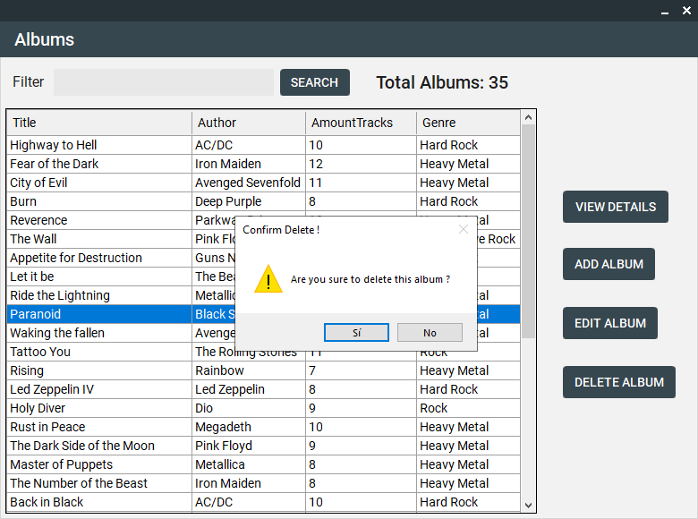

# Albums App - Gestor de álbumes musicales

Este proyecto es una aplicación de escritorio que permite gestionar una lista de álbumes musicales. La aplicación está desarrollada con C#, WinForms .NET Framework y ADO.NET para interactuar con la base de datos.

## Características:

- Permite agregar, modificar, ver detalles y eliminar álbumes.

- Permite filtrar resultados a través de una barra de búsqueda.

- Los cambios que haga el usuario en la aplicación se verán reflejados directamente en la base de datos.
  
- Los álbumes pueden tener los siguientes datos:

````
- Título

- Autor

- Fecha de publicación

- Número de pistas

- Imagen

- Género
````

## Implementaciones:

- Programación orientada a objetos (clases, encapsulación, abstracción).
- Modularización del código haciendo uso de la arquitectura en capas.
- Manejo de excepciones.
- Uso de validaciones.
- Manipulación de bases de datos relacional (SQL).
- Uso de interfaz gráfica (navegación entre formularios).

## Screenshots

- Vista formulario principal


- Vista formulario agregar album


- Vista formulario principal filtrar


- Vista formulario detalles album


- Vista formulario editar album


- Vista eliminar album



## Video explicativo

<p>
  <a href="https://www.youtube.com/watch?v=P0SVGRKOtPo">
  
 </a>
</p>
